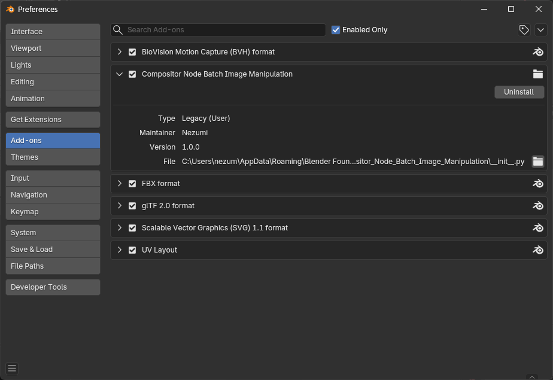
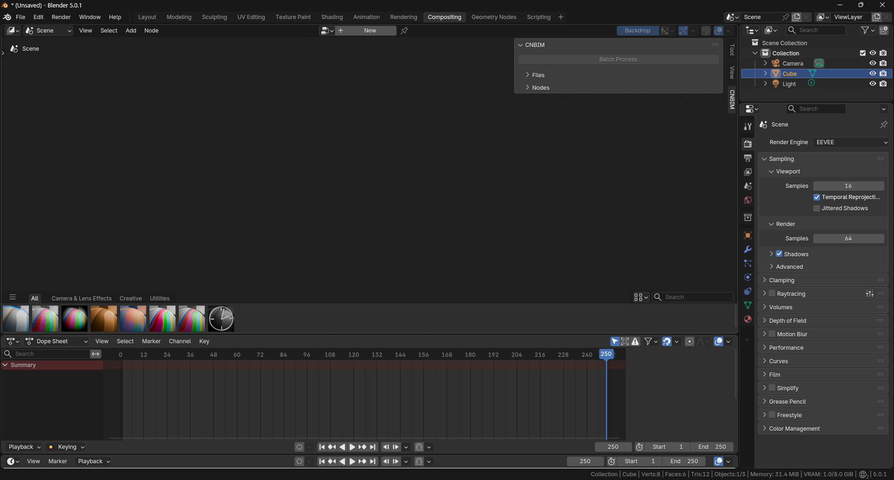
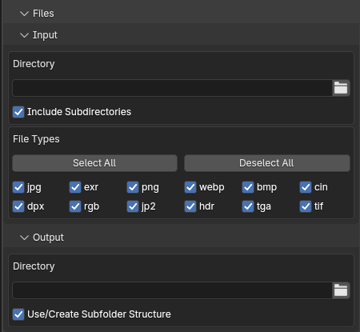
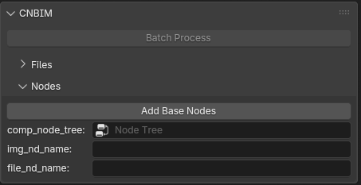
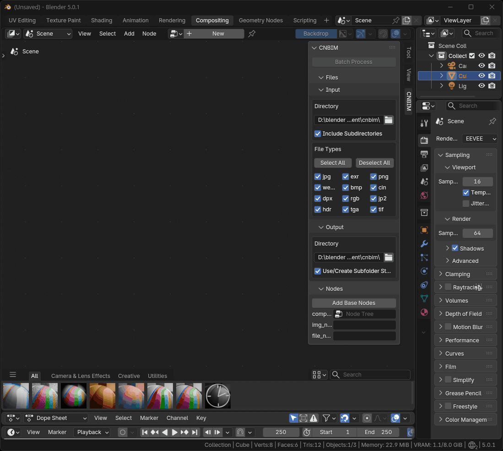
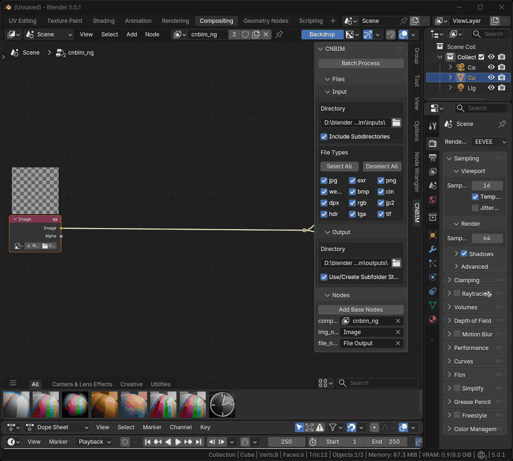
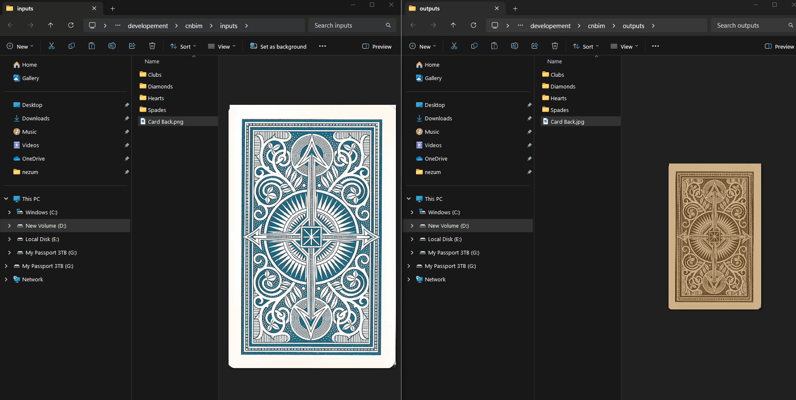

# Compositor Node Batch Image Manipulation:

Simple UI to demonstrate Blender's capability for batch image manipulation.

# Contents

1. [Installation](#installation)
2. [Panel Layout](#panel-layout)
3. [Basic Operation](#basic-operation)

# Installation:

* Download `.zip` file.
* From the `Edit` menu select `Preferences` > `Add-ons`.
* In the preferences panel select install and browse to the `cnbim.zip` file.
* tags = ["File", "Image", "Import-Export", "User"]

[Back to Contents](#contents)

# Panel layout:

The Panel is located in the Compositing Editor UI (N-Panel) CNBIM tab and consists of 3 major parts.

* The operator `Batch Process` button is enabled once all other parameters are valid.

* The `Files` section consists of 2 collapsable subpanels and properties for starting directories, filetypes to include in processing and whether or not to use subfolders when batch processing.

* The `Nodes` section contains an operator to setup a basic node tree and properties to allow the addon to know which input and output node you wish to use if your node tree becomes complex (multiple image inputs or file outputs).

[Back to Contents](#contents)

# Basic Operation

Select the Input directory (top level) of the images you wish to manipulate.

`Include Subdirectories` when enabled will recursively search all subfolders from the input directory. If unchecked only files contained within the source directory will be processed.

Filter any file types you do not wish to process (in the event of mixed image types in a directory).

Assign the top level output directory.

`Use/Create Subfolder Structure` when enabled will create and place proccessed images in a tree folder structure mirroring the input subfolders. If unchecked all processed images will be placed in the output directory.

Add the basic node setup and select the nodes provided.

The output file type and settings are controlled from the `File Output` node (not your scene render settings). Set as desired.

Add some nodes to manipulate your images.

Run the `Batch Process`.

Your new batch images are available in the output directory you specified from the CNBIM panel.

